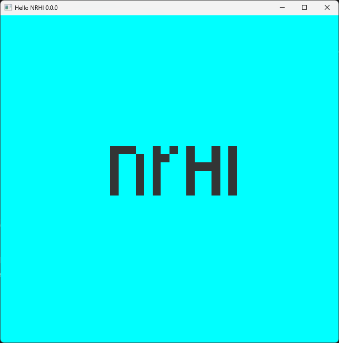

# NRHI
NCoder's Learning Aimed C++ Render Hardware Interface Library.

---

## Features
+ Flexible, optimized and supports multiple drivers (`drivers mean low-level graphics APIs like DirectX 11, DirectX 12, OpenGL, Vulkan,...`):
  + Compile-time abstraction for single driver
  + Run-time abstraction for multiple drivers 
  + Quick cross-driver implementation for enums and functions 
  + ...
+ Supported drivers:
  + DirectX 11
+ Shading languages:
  + HLSL
  + NSL (`NCoder's shading language`)

---

---

## Core Dependencies
+ NCPP
+ NMath
+ NSurface
+ SPIRV-Cross

---

## Supported Drivers 
  + DirectX 11

---

## Future-Compatible Drivers 
  + DirectX 12
  + Vulkan
  + Metal
  + OpenGL/OpenGLES

---

## Supported Platforms 
  + Windows

---

## Future-Compatible Platforms 
  + MacOS
  + Android
  + IOS

---

## Supported IDEs and Text Editors (for scripts)
  + Visual Studio
  + Xcode
  + CLion
  + Visual Studio Code

---

## Building
  + **Visual Studio 2022** (Windows):
    + Step 1: Clone [NRHI git repository](https://github.com/Abytek/NRHI) from GitHub
    + Step 2: Generate Visual Studio 2022 solution by running **scripts/generate_vs2022.bat**
    + Step 3: Navigate to **build/vs2022**
    + Step 4: Open **nrhi.sln**
    + Step 5: Set **nrhi.samples.hello_nrhi** as startup project
    + Step 6: Run and enjoy!
  + **Xcode** (MacOS):
    + Step 1: Clone [NRHI git repository](https://github.com/Abytek/NRHI) from GitHub
    + Step 2: Generate Xcode solution by running **scripts/generate_xcode.sh**
    + Step 3: Navigate to **build/xcode**
    + Step 4: Open **nrhi.xcodeproj**
    + Step 5: Choose **nrhi.samples.hello_nrhi** for current scheme
    + Step 6: Run and enjoy!
  + **CLion** (Windows, MacOS, Linux):
    + Step 1: Clone [NRHI git repository](https://github.com/Abytek/NRHI) from GitHub
    + Step 2: Open CLion by running one of these scripts based on your environment (you may need to use chmod +x command first on Linux and MacOS for execute permission):
      + Windows
        + **scripts/python_open_clion.bat**
        + **scripts/python3_open_clion.bat**
      + MacOS, Linux:
        + **scripts/python_open_clion.sh**
        + **scripts/python3_open_clion.sh** 
    + Step 3: At **On Project Wizard**, click "OK" (if you dont see it, dont worry, go to the next step).
    + Step 4: Run and enjoy!
  + **Unix makefiles**:
    + Step 1: Clone [NRHI git repository](https://github.com/Abytek/NRHI) from GitHub
    + Step 2: Generate makefiles by running **scripts/generate_unix_makefiles.sh**
    + Step 3: execute **scripts/build_unix_makefiles.sh** to build project
    + Step 4: Navigate to **build/unix_makefiles/nrhi/samples/hello_nrhi**
    + Step 5: Run "nrhi.samples.hello_nrhi" and enjoy!

---

## License
+ NRHI is licensed under the [MIT License](https://github.com/n-c0d3r/NRHI/blob/main/LICENSE)
